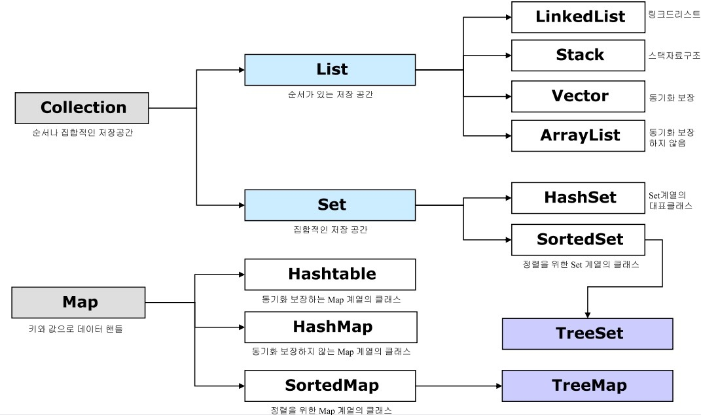

# 2021-Java-Study 10주차 과제

## 자바 기초

## 컬렉션 프레임 워크(JCF)
> 자바 컬렉션 프레임 워크란 Java에서 데이터를 저장하는 기본적인 자료구조들을 한 곳에 모아 관리하고 편하게 사용하기 위해 제공하는 것을 의미한다. 



|인터페이스|구현클래스|특징|
|----------|------|---|
|List|LinkedList<br>Stack<br>Vector<br>ArrayList<br>|순서가 있는 데이터 집합, 중복 허용|
|Set|HashSet<br>TreeSet<br>|순서유지 않는 데이터 집합,중복 허용x|
|Map|HashMap<br>TreeMap<br>HashTable<br>|Key-Value쌍의 데이터 집합으로 키는 중복x, 값은 중복 허용가능|

### List 인터페이스
LinkedList: 양방향 포인터 구조, 데이터 삽입/삭제 빈번시 유용, 검색은 ArrayList에 비해 비효율적<br>
Stack: 한 쪽 끝에서 자료를 넣고 뺄 수 있는 자료구조
Vector: 동적 크기 배열, 배열과 마찬가지로 index로 배열에 접근 가능, 동기화 되어 있어 한번에 하나의 쓰레드만 벡터 메소드 호출 가능, 멀티 쓰레드 환경 아닌 경우에는 ArrayList를 사용 하는 것이 바람직 할 수 있음<br>
ArrayList: 단방향 포인터 구조, 데이터에 대한 index 가지며 조회 기능 성능 뛰어남, 데이터 삽입/삭제가 빈번할 경우 비효율적<br>

### Set 인터페이스
HashSet: 순서 예측 불가능, 해시 알고리즘 사용한 가장 빠른 임의 접근 속도 가짐<br>
TreeSet: 이진 검색 트리 형태로 데이터 저장, 저장 순서 유지x<br>

### Map 인터페이스
HashMap: 중복과 순서 허용x, Value에 Null 값 넣을 수 있음 <br>
TreeMap: 키 값이 자연 순서 대로 오름차수 정렬 되어 Key-Value쌍으로 저장. 정렬되어 검색이 빠름 <br>
HashTable: HashMap보다는 느리지만 동기화 지원, Value에 Null값 허용X


## Stream의 특징 정리 (map,filter,sorted,distinct,limit,foreach)
```
ArrayList<string> list = new ArrayList<>(Arrays.asList("Apple","Banana","Apple",Melon","Grape","Strawberry"));
```

### map
> 요소들을 특정조건에 해당하는 값으로 변환
> <br> 요소들을 대,소문자 변형 등 작업 시 사용

```
list.stream().map(s->s.toUpperCase());
list.stream().map(String::toUpperCase);
```
이후 collect를 통해 결과를 리턴 받을 수 있다. forEach를 통해 바로 출력도 가능하다.
```
System.out.println(list.stream().map(s->s.toUpperCase()).collect(Collectors.toList())); //[APPLE, BANANA, APPLE, MELON, GRAPE, STRAWBERRY]
```
### filter
> 요소들을 조건에 따라 걸러내는 작업
> <br> 길이 제한, 특정문자 포함 등 작업 시 사용

```
list.stream().filter(t->t.length()>5)
```
요소 크기가 5보다 큰 것만 걸러내 준다.
```
System.out.println(list.stream().filter(t->t.length()>5).collect(Collectors.toList())); //[Banana, Strawberry]
```
### sorted
> 요소들을 정렬해주는 작업
```
list.stream().sorted()
```
리스트의 요소를 정렬해준다.
```
System.out.println(list.stream().sorted().collect(Collectors.toList())); //[Apple, Apple, Banana, Grape, Melon, Strawberry] 
```
### discinct
> 요소의 중복을 제거해주는 작업
```
list.stream().distinct()
```
리스트의 중복을 제거해준다.
```
list.stream().distinct().forEach(System.out.println);
// Apple
// Banana
// Melon
// Grape
// Strawberry
```
### limit
> 어떤 스트림에서 일정 개수만큼 가져와 새로운 스트림을 리턴해주는 작업
```
list.stream.limit(3).forEach(System.out.println);
// Apple
// Banana
// Apple
```
### foreach
> 요소들을 하나씩 출력하는 작업
```
list.stream.forEach(System.out.println);
// Apple
// Banana
// Apple
// Melon
// Grape
// Strawberry
```

## Collection.forEach와 Stream.forEach 차이
### Stream 객체 사용 여부
Collection.forEach의 경우에는 따로 객체를 생성하지 않고 메소드를 호출한다.<br>
반면에 Stream.forEach는 stream()으로 Stream 객체를 생성해야만 메소드를 호출할 수 있다.

```
list.forEach(System.out::println);
list.stream().forEach(Systmem.out::println);
```

### Parallel Stream
```
public void print() { List<Integer> nums = Arrays.asList(1, 2, 3, 4, 5);
    System.out.println("Collection.forEach 출력 시작");
    nums.forEach(System.out::println);
    System.out.println("Stream.forEach 출력 시작");
    nums.parallelStream().forEach(System.out::println); }
//Collection.forEach 출력 시작
//1
//2
//3
//4
//5
//Stream.forEach 출력 시작
//3
//4
//1
//5
//2

출처: https://dundung.tistory.com/247 [DunDung]
```
ParallelStream으로 생성한 스트림 객체는 여러 스레드에서 스트림을 실행하기에 실행순서가 예측 불가능한 반면 Collection.forEach는 일정한 순서를 보장한다.

## for문을 stream으로 변환하는 법

```
List<String> list1= Arrays.asList("a", "b", "c", "d", "e");
List<String> list2 = Arrays.asList("a", "b", "d");

//for문 사용해 같은 것만 List에 담으려면

List<String> result1 = new ArrayList<>();
    for(String str1 : list1){
        for(String str2 : list2){
            if(str1.equals(str2)){
                result1.add(str1);
            }
        }
    }
    for(String str : result1){
        System.out.print(str);
    }

// stream 이용해 같은 것만 List에 담으려면
 List<String> result2 =
    list1.stream()
        .filter(str -> list2.stream().anyMatch(Predicate.isEqual(str)))
        .collect(Collectors.toList());

    result2.stream().forEach(System.out::print);

```

